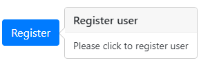
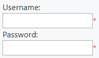
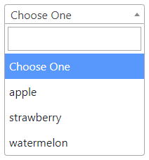
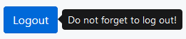

# Wicket reusables

Wicket 8.x reusables panels and behaviors for jQuery and Bootstrap 4.x components

- [x] Beta version - not ready for production yet
- [ ] Configure to push to maven central repository

## Behaviors

|Name|Based on|Status| |Example|  
|:---|:---|:---:|:---:|---:|  
|PopoverBehavior|[Bootstrap Popover](https://getbootstrap.com/docs/4.0/components/popovers/)|:ballot_box_with_check:||| 
|FieldRequiredBehavior|[RedAsteriskBehavior](https://ci.apache.org/projects/wicket/guide/8.x/single.html#_enriching_components_with_behaviors)|:ballot_box_with_check:| ||
|Select2Behavior|[Select2](https://select2.org/)|:clock3:| ||
|TooltipBehavior|[Bootstrap Tooltip](https://getbootstrap.com/docs/4.0/components/tooltips/)|:clock3:| ||

---

__PopoverBehavior__

> Relies on the 3rd party library Popper.js for positioning. __You must include popper.min.js before bootstrap.js__
    
```java
// Example 1
// Popover default values: data-trigger='hover', data-placement='right'
Button button = new Button("Register");
button.add(new PopoverBehavior("Register user", "Please click to register user");
```
```java
// Example 2
Button button = new Button("Register");
button.add(new PopoverBehavior()
            .withTitle("Register user")
            .withContent("Please click to register user")
            .withTrigger(Trigger.CLICK)
            .withPlacement(Placement.BOTTOM)
            .withAnimation(false)
            .withOffset(200));
```

---

__FieldRequiredBehavior__

> Adds &lt;span class='field-required'&gt;*&lt;/span&gt; html entry to required fields. Please add .field-required { color: red }
> to css file. 
    
```java
// Example
TextField field = new TextField("username");
field.setRequired(true);
field.add(new FieldRequiredBehavior());
```

---

__Select2Behavior__

> Adds [Select2](https://select2.org/) javascript plugin for a customizable select box.

```java
// Example 1
List<String> fruits = Arrays.asList("apple", "strawberry", "watermelon");
DropDownChoice<String> selectBox = new DropDownChoice<>("fruits", new Model<>(), fruits);
selectBox.add(new Select2Behavior());
```

```java
// Example 2
List<String> fruits = Arrays.asList("apple", "strawberry", "watermelon");
DropDownChoice<String> selectBox = new DropDownChoice<>("fruits", new Model<>(), fruits);
selectBox.add(new Select2Behavior() {

    @Override
    protected Select2Options createSelect2Options(Component component) {
        return new Select2Options()         
                .withWidth("200")
                .withDropdownAutoWidth(true);
    }

    @Override
    protected Select2OnEvent createSelect2OnEvent(Component component) {
        return new Select2OnEvent()
                .onEvent("select2:select", "function(event) { console.log(event); }")
                .onEvent(Select2Events.SELECT2_OPENING, "function(event) { console.log(event); }");
    }
});
```

---

__TooltipBehavior__

> Relies on the 3rd party library Popper.js for positioning. __You must include popper.min.js before bootstrap.js__
    
```java
// Example 1
Button button = new Button("Logout");
button.add(new TooltipBehavior("Do not forget to log out!");
```

```java
// Example 2
Button button = new Button("Logout");
button.add(new TooltipBehavior("Do not forget to log out!", Placement.RIGHT);
```

```java
// Example 3
Button button = new Button("Logout");
button.add(new TooltipBehavior()
            .withTitle("Do not forget to log out!")
            .withPlacement(Placement.RIGHT)
```


## 
#### Author

Linkedin: [https://www.linkedin.com/in/slawektuleja/](https://www.linkedin.com/in/slawektuleja/)

#### License

You can use this software freely in any free or commercial project
